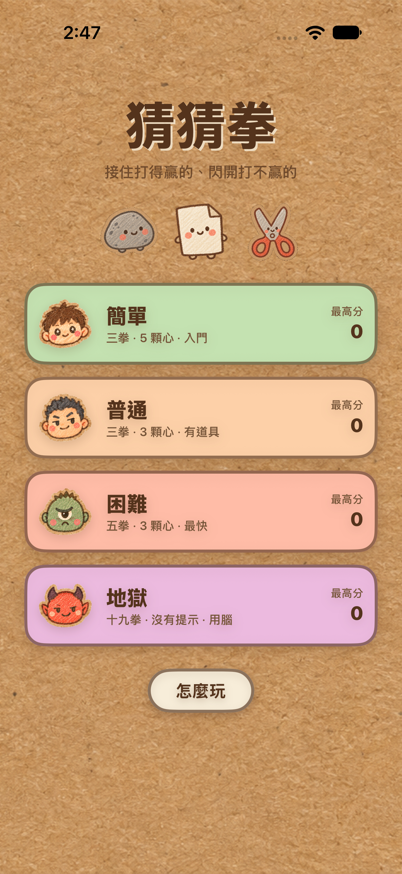
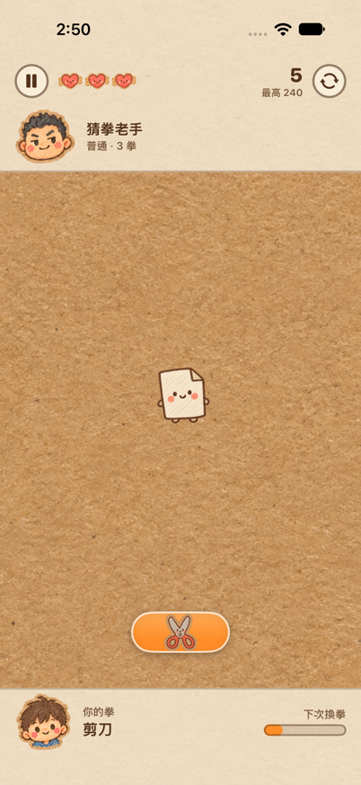
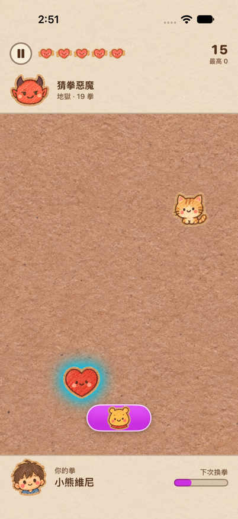
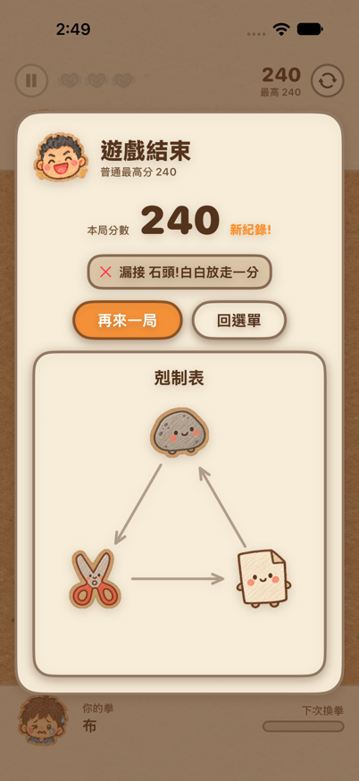
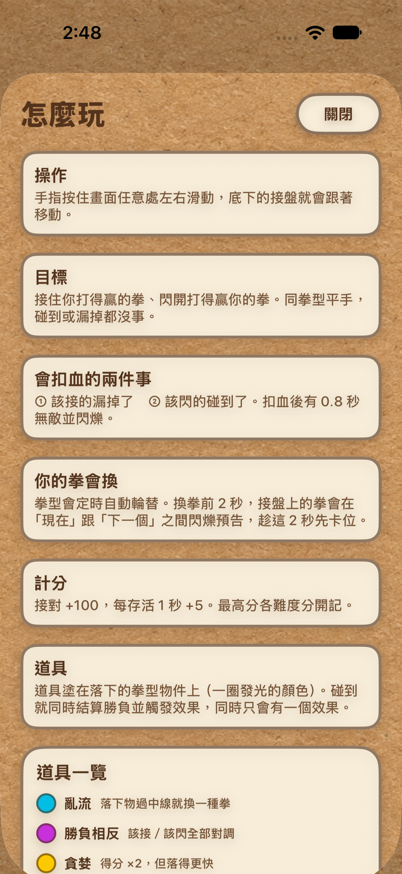
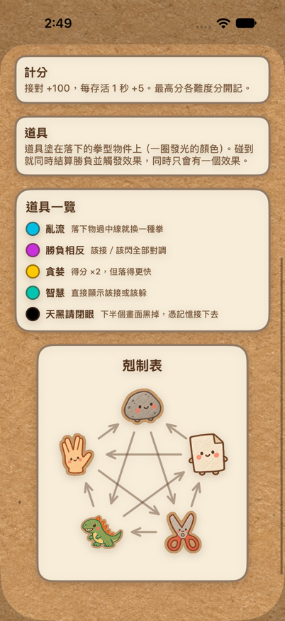

# 猜猜拳

> 接住打得贏的、閃開打不贏的。

一款用 SwiftUI 寫的單手操作反應遊戲。拳型會從天上掉下來,而**你的拳會定時自己換掉** —— 同一顆球上一秒該接、下一秒就該閃。蠟筆手繪風格,四個難度,最硬的地獄模式有 19 種拳而且不給你看剋制表。

iOS 作業 1 專案。

---

## 畫面

| 標題 | 遊戲中(普通) | 地獄模式 |
|---|---|---|
|  |  |  |
| 四個難度各自記最高分 | 你的拳是剪刀,掉下來的布該接 | 19 拳、5 顆心,愛的外圈發光代表附帶「亂流」道具 |

| 結算 | 怎麼玩 | 道具與剋制表 |
|---|---|---|
|  |  |  |
| 附上最後一條戰報,說明你是怎麼死的 | 規則一頁講完 | 道具一覽與五拳剋制圖 |

---

## 怎麼玩

**操作**:手指按住畫面任意處左右滑動,底下的接盤跟著移動。不用精準按在接盤上。

**目標**:接住你打得贏的拳,閃開打得贏你的拳。同拳型平手,碰到或漏掉都沒事。

**扣血只有兩種情況**:

1. 該接的漏掉了
2. 該閃的碰到了

扣血後有 0.8 秒無敵並閃爍,不會被連續打死。

**你的拳會自己換**。拳型定時輪替,換拳前 2 秒接盤上的拳會在「現在」跟「下一個」之間閃爍預告 —— 這 2 秒是拿來提前卡位的,而不是通知你來不及了。底部的進度條顯示距離換拳還有多久。

**計分**:接對 +100,每存活 1 秒 +5。最高分各難度分開記,存在 `UserDefaults`。

**難度會一直漲,沒有上限**。每存活 20 秒套用一次遞增:掉落速度 ×1.09、生成間隔 ×0.91。撐越久越快越密,唯一的下限是生成間隔 0.08 秒(避免每一幀都生成把遊戲壓垮,這不是難度天花板)。

---

## 四個難度

| 難度 | 拳種 | 生命 | 初始落速 | 初始生成間隔 | 換拳間隔 | 道具 | 剋制表 |
|---|---|---|---|---|---|---|---|
| 簡單 | 3(石頭剪刀布) | 5 | 250 pt/s | 1.15 s | 10 s | — | ✅ |
| 普通 | 3 | 3 | 330 pt/s | 0.85 s | 8 s | ✅ | ✅ |
| 困難 | 5(加蜥蜴、史巴克) | 3 | 420 pt/s | 0.70 s | 6 s | ✅ | ✅ |
| 地獄 | 19 | 5 | 250 pt/s | 1.15 s | 10 s | ✅ | ❌ |

地獄模式的起始數值刻意照抄簡單:它的難度來自「拳種多 + 沒有提示 = 要動腦推理」,不是靠手速。19 種拳包含哥吉拉、核彈、虛式茈、小熊維尼、雞哥、C羅 等等,而且每一對勝負都有專屬的戰報字幕 —— 把推理變成笑點,也讓你在死了幾次之後自然記住關係表。

---

## 道具

道具不是獨立物件,而是**塗在落下拳型上的一層顏色光暈**。碰到就同時結算勝負並觸發效果。同一時間只有一個效果,吃到新的覆蓋舊的。

| 道具 | 光暈顏色 | 效果 | 持續 |
|---|---|---|---|
| 亂流 | 青 | 落下物過中線就換成下一種拳 | 7 s |
| 勝負相反 | 紫 | 該接／該閃全部對調 | 6 s |
| 貪婪 | 黃 | 得分 ×2,但落得更快(×1.35) | 8 s |
| 智慧 | 薄荷綠 | 直接顯示該接或該躲 | 6 s |
| 天黑請閉眼 | 黑 | 下半個畫面黑掉,憑記憶接下去 | 3 s |

幾個刻意的設計:

- **道具永不直接扣血**,而且只塗在「該接」的物件上,避免負面效果跟扣血情境重疊變成必死。
- **智慧生效期間換拳倒數整個凍住**,結束後再多給 1 秒緩衝 —— 判讀剛還給你就馬上換拳,玩家根本反應不過來。
- **智慧結束前 1.8 秒開始閃回真正的拳型**,最後 0.5 秒完全不再顯示標記,讓你在效果消失前就已經接手判讀。

---

## 專案結構

```
ioshw1/
├── MyApp.swift               @main,注入 HighScoreStore
├── ContentView.swift         流程:標題 → 遊戲 → 回標題
├── Models/
│   ├── HandShape.swift       拳型與 HandRuleSet(勝負判定核心)
│   ├── HellRuleSet.swift     地獄的 19 拳對戰表與專屬戰報(由腳本產生)
│   ├── Difficulty.swift      四個難度的全部數值參數
│   ├── FallingObject.swift   落下物
│   └── PowerUp.swift         五種道具
├── Game/
│   ├── GameEngine.swift      遊戲迴圈、碰撞、計分、生成
│   └── SoundPlayer.swift     音效
├── Storage/
│   └── HighScoreStore.swift  各難度最高分(UserDefaults)
└── Views/
    ├── GameView.swift        HUD、場地、手勢、暫停／結算疊層
    ├── TitleView.swift       標題與「怎麼玩」
    ├── GameOverView.swift    結算
    ├── RuleChartView.swift   剋制表
    ├── FallingObjectView.swift / FaceView.swift / GameArt.swift
    └── CrayonStyle.swift     蠟筆風格的字體、紙面板、按鈕
```

### 兩個值得一提的地方

**勝負判定不寫死任何 if-else。** 整套規則就是一句話:

```swift
func relation(player playerID: String, object objectID: String) -> HandRelation {
    if playerID == objectID { return .tie }
    if shape(playerID).beats.contains(objectID) { return .playerWins }
    return .objectWins
}
```

每張拳只列自己的打贏清單,清單外一律算輸。所以從 3 拳擴充到 5 拳、19 拳只是換一張 `HandRuleSet` 表,引擎一行都不用改。

**生成器會主動避開必死局面。** 如果場上唯一能接的物件正上方又丟一顆「該閃的」,接盤只有一個 → 玩家不管怎麼動都得扣血。`spawnObject()` 會把被佔用的落點從候選中移掉。同理,超過 2.5 秒沒有任何可接物件時會強制生成一顆(除非玩家正卡在打不贏任何東西的「絕境拳」)。

---

## 技術

- **SwiftUI** + `@Observable`(不使用 Combine)
- 遊戲迴圈用 `Task` + `ContinuousClock`,每 16 ms 一幀,delta time 夾在 1/20 秒以內避免切回前景時一次跳一大段
- `GameEngine` 標記為 `@MainActor`,狀態變更直接驅動 SwiftUI 重繪
- 切到背景自動暫停,回來不會被偷扣血
- 所有美術資源都在 `Assets.xcassets`。玩家表情有 neutral／happy／hurt,對手表情有 neutral／hurt／taunt 且四個難度各一組 —— 你接對他就痛,你扣血他就嘲諷
- 得分音效預先建好 4 個 `AVAudioPlayer` 輪流用,連續接對時聲音才能疊著響而不是互相切斷;音訊分類用 `.ambient`,尊重使用者的靜音開關

## 執行

需要 **Xcode 27**,部署目標 **iOS 27.0**。

```
open ioshw1.xcodeproj
```

選任一 iPhone 模擬器後 ⌘R。iPad 與 Vision Pro 也在支援的裝置家族內。

---

## 開發紀錄

`conversation.txt` 保留了這個專案的完整開發對話紀錄。
